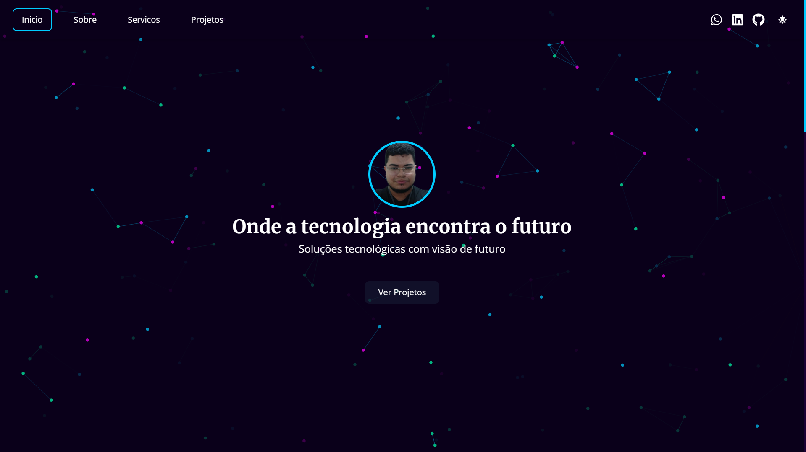

# 🌟 Meu Portfólio - Madson Jhones 🚀  

🔗 **Acesse agora:** [madsonjhones.github.io/portfolio](https://madsonjhones.github.io/portfolio/)  

## 📌 Sobre  
Bem-vindo ao meu portfólio! Aqui você encontra meus projetos, habilidades e um pouco sobre minha jornada como desenvolvedor. Navegue, explore e conheça meu trabalho!  

## 🎨 Tecnologias Utilizadas  
🖥️ **Front-end:** React JS, JavaScript, TypeScript  
📱 **Mobile:** Flutter  
⚙️ **Back-end:** Python, PyTorch, TensorFlow  
🎨 **Design:** Figma, UI/UX  

## 📸 Screenshot  
  
